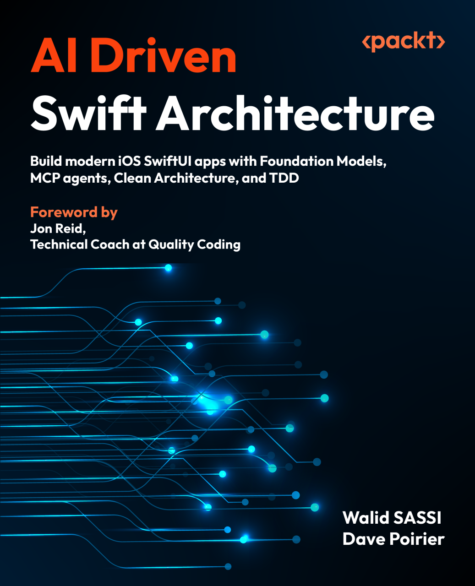

# 👋 Welcome to My GitHub Profile!

I’m Walid SASSI, a Tunisian software developer, a father of three, and resident of Picardie, France. My work centers on:

- **Software Architecture**: Designing clean, maintainable, and modular systems.
- **Distributed Systems**: Exploring scalability, fault tolerance, and system design.
- **Development Tools**: Crafting tools to streamline workflows and improve productivity.

## 🌐 Connect with Me
- 🖥️ Website: [Walid SASSI Blog](https://walidsassi.com)
- 💼 LinkedIn: [My Linkedin](https://linkedin.com/in/sassi-walid)
- [Swifttribune Blog](https://swifttribune.walidsassi.com)

## 🎙️ My Content
- 🎥 **YouTube Channel**: [Swift With Walid](https://www.youtube.com/@SwiftWithWalid)
- 🎙️ **Podcast**: [Swift Academy](https://podcasts.apple.com/fr/podcast/swift-academy-the-podcast/id1730260283)

## 🛠️ Technical Skills
- **Languages**: Swift, Objective-C, Java.
- **Frameworks**: RxSwift, SwiftUI, Combine.
- **Focus Areas**: Distributed architectures, Clean Architecture, CI/CD.

Thank you for stopping by! Let's build something amazing together. 😊
